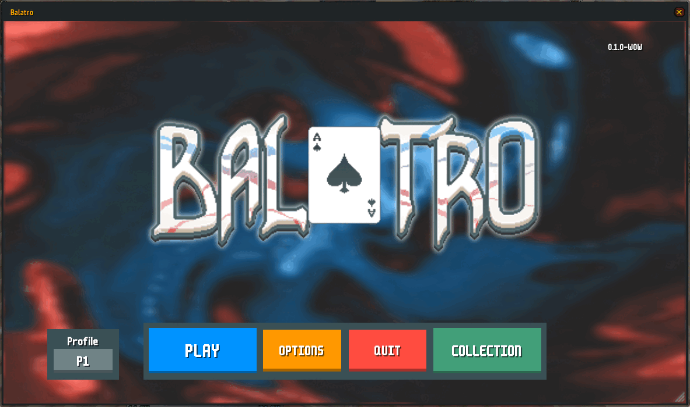

# Balatro for World of Warcraft

Balatro inside World of Warcraft Forever.

<p align="center">
  
</p>

> [!IMPORTANT]
> This is a **fan version**, not affiliated with or endorsed by LocalThunk or Playstack. If you like it, [buy the real game](https://store.steampowered.com/app/2379780/Balatro/), it's way better than this.

The goal is to be as close as possible to PC Balatro: same layout, same flow and same rules (shop, packs, vouchers, tags, boss blinds, challenges, collection, etc.). _Should_ be playable from start to finish, but it's still a WIP so expect some bugs.

## Install

1. Download the latest `Balatro-x.x.x.zip` from the [releases](https://github.com/Taeko-ar/Balatro-wow/releases).
2. Unzip it inside `World of Warcraft/Interface/AddOns/` (you should end up with `Interface/AddOns/Balatro/Balatro.toc`).
3. Restart the game (a `/reload` is not enough the first time).

## Commands

- `/balatro` - Open/close the window (or use the minimap button).
- `/balatro reset` - Go back to the main menu.
- `/balatrodebug` - Toggles the debug mode.

## Development

```bash
tools/build-addon.sh <path to AddOns/Balatro>   # build and copy the addon (needs ImageMagick)
tools/package.sh v1.0.0                         # build dist/Balatro-1.0.0.zip
luaenv/bin/luacheck .                           # lint
selene Engine Runtime Core Game UI Data         # lint (second pass)
stylua Engine Runtime Core Game UI Data         # format
```

## Credits

[LocalThunk](https://www.playbalatro.com/) \
Creator of [Balatro](https://store.steampowered.com/app/2379780/Balatro/) (published by [Playstack](https://www.playstack.com/)). All the art, sounds, names and game design belong to them.

[Gazpacho (idkhan)](https://github.com/idkhan) \
Balatro 3DS: https://github.com/idkhan/Balatro3DS \
The game logic of this addon is based on their 3DS remake.

[a327ex](https://github.com/a327ex) \
The base object class comes from [SNKRX](https://github.com/a327ex/SNKRX) (MIT).
